<p align="center">
  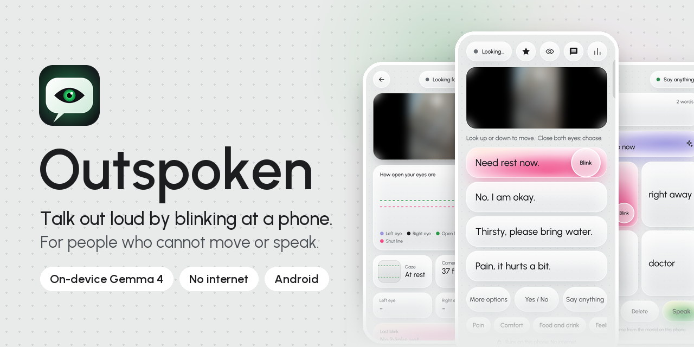
</p>

<p align="center">
  <a href="https://github.com/DarkBird10020/outspoken/actions/workflows/ci.yml"></a>
  <a href="LICENSE"></a>
  
  
  
  
</p>

<p align="center">
  <b>Outspoken lets people who cannot move or speak talk out loud by blinking at a phone, with no internet.</b>
</p>

<p align="center">
  <a href="#why-outspoken">Why</a> ·
  <a href="#features">Features</a> ·
  <a href="#screenshots">Screenshots</a> ·
  <a href="#how-it-works">How it works</a> ·
  <a href="#getting-started">Getting started</a> ·
  <a href="#contributing">Contributing</a>
</p>

---

## Why Outspoken

Some people are awake and aware but cannot speak or use their hands: a patient on a ventilator, a person with ALS, someone paralysed after a stroke. They can think clearly, but they cannot say "I am in pain" or "I need water". Dedicated eye-tracking devices cost a great deal, and existing phone apps either offer a fixed list of phrases or make the person spell every letter, which is slow and tiring.

Outspoken runs on an ordinary Android phone standing at the bedside:

1. **It listens.** The visitor asks a question out loud, and the phone hears it with on-device speech recognition.
2. **It suggests.** Gemma 4, running on the phone, writes four short replies that answer that question.
3. **The person chooses with their eyes.** They move the highlight with their eyes and close them for about half a second on the reply they want. The phone says it out loud.

Everything runs on the phone. The app has no internet permission, and CI fails any build that asks for it.

## Features

| | |
|---|---|
| **Replies that fit the question** | Gemma 4 E2B writes four first-person replies to what the visitor just said, in about a second. A built-in phrase bank shows at once and takes over if the model fails. |
| **Choose by blinking** | Our own blink detector, calibrated to each person, tells a deliberate close (about 0.4 s) from a normal blink. |
| **Two ways to move** | *Look up to move*: look above the phone for the next card. *Blink only*: the highlight moves on a timer, and a blink chooses. |
| **Say anything** | Build any sentence a few words at a time: the model suggests the next four words and a finished sentence that one blink says. |
| **Hand signs (optional)** | For someone who can still lift a hand into the camera's view: one to four fingers (thumb folded) light the first to fourth card and a fist says it, so any card can be chosen by hand; 👍 "Yes", 👎 "No", 🤟 "I love you", ✋ the whole hand open "Please wait". Held a moment (the fist a second); each sign can be switched off for a person. Off by default. |
| **Hindi (optional)** | Settings, English / हिन्दी: the reply cards are written in Hindi by the same on-device model (nothing is translated), with a Hindi phrase bank, topic buttons and fixed cards, a Hindi voice, and the visitor heard in Hindi. "Follow the visitor" switches the cards to the language the visitor speaks. Android's own speech service downloads the Hindi speech pack; Settings opens the voice download when the Hindi voice is missing. |
| **Help alarm** | Eyes shut for 2 seconds, then a blink, sounds a loud alarm and shows a full-screen alert. |
| **Calibration and practice** | Every start measures this person's eyes in about 30 seconds. A practice round teaches the blink and measures accuracy. |
| **Listening** | On-device speech recognition hears the visitor, in one session that runs until the mic is switched off, with the words shown as they are said. Typed questions and one-tap topics cover noisy rooms. |
| **Transcript and stats** | A large-type transcript for a laptop (Office Kit), and a stats screen with reply time, model speed, blink accuracy and session length. |
| **Frequent phrases** | Sentences the person says often move to the front during a session. |
| **Private by design** | No account, no cloud, no internet permission. Run logs stay in the app's own folder on the phone. |

## Screenshots

<table>
  <tr>
    <td align="center" width="33%">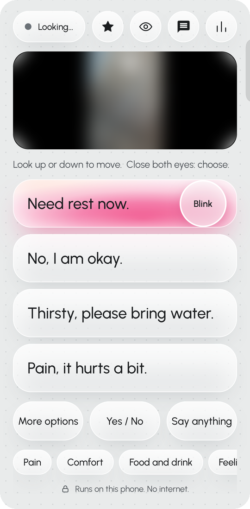<br><b>Conversation</b><br><sub>Four replies, the lit card and the fixed cards</sub></td>
    <td align="center" width="33%">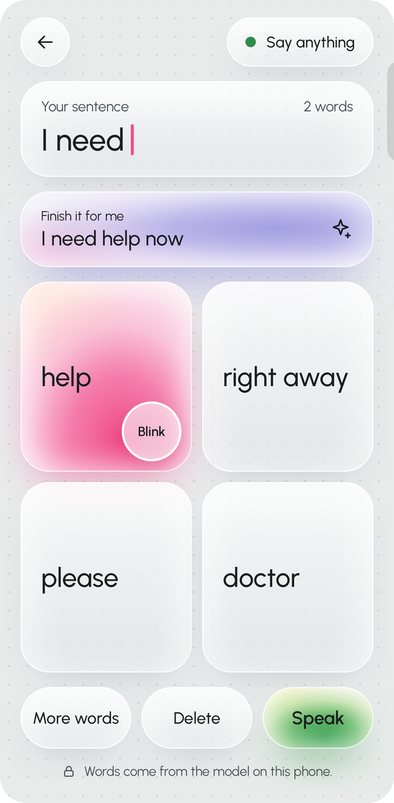<br><b>Say anything</b><br><sub>Next words and a finished sentence from the model</sub></td>
    <td align="center" width="33%">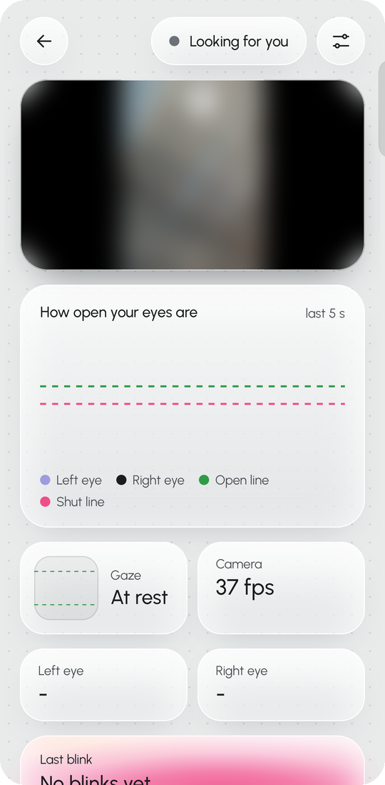<br><b>Eye check</b><br><sub>Live eye graph, gaze and the last blink</sub></td>
  </tr>
  <tr>
    <td align="center">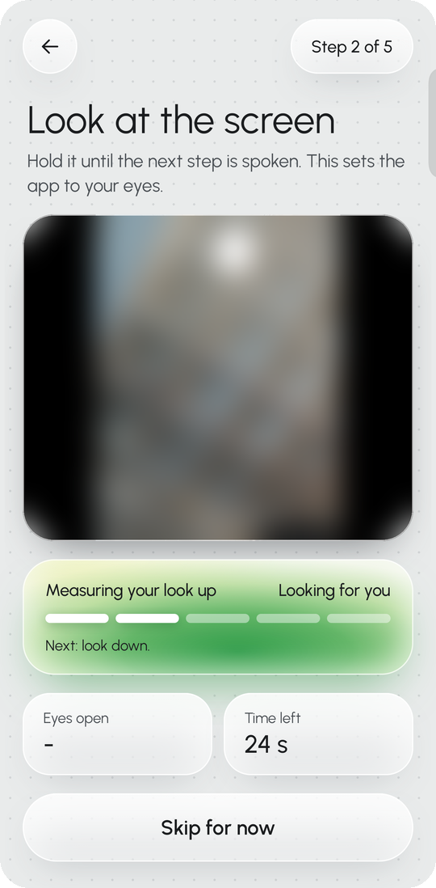<br><b>Calibration</b><br><sub>Five spoken steps, about 30 seconds</sub></td>
    <td align="center">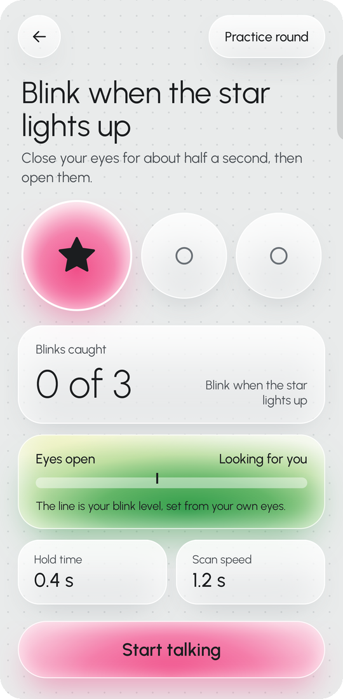<br><b>Practice round</b><br><sub>Catch three stars by blinking</sub></td>
    <td align="center">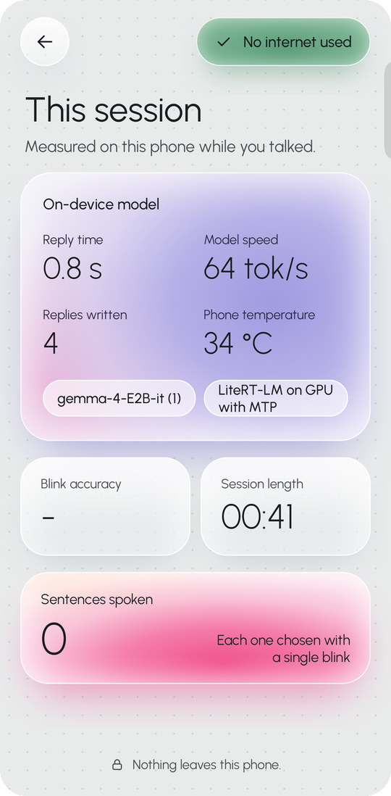<br><b>Session stats</b><br><sub>Reply time, model speed, phone temperature</sub></td>
  </tr>
  <tr>
    <td align="center">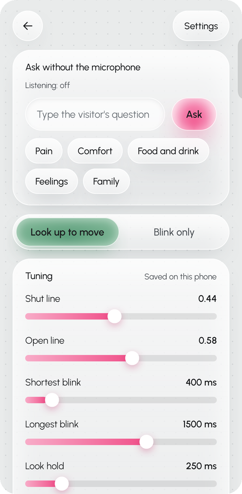<br><b>Settings</b><br><sub>Typed questions, mode and tuning</sub></td>
    <td align="center">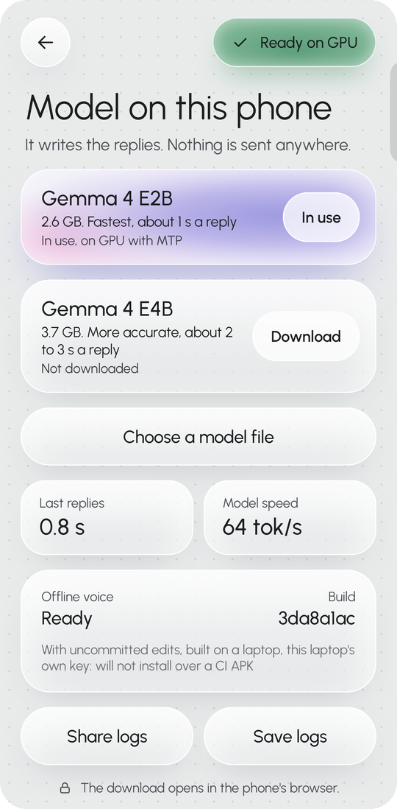<br><b>Model</b><br><sub>Download and switch Gemma, share logs</sub></td>
    <td align="center">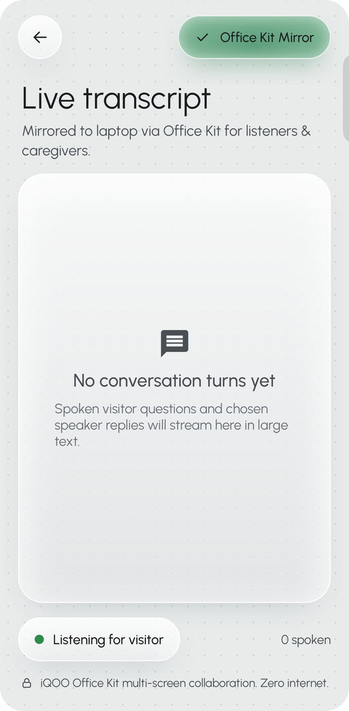<br><b>Transcript</b><br><sub>Large type for a laptop through Office Kit</sub></td>
  </tr>
</table>

<sub>Screenshots from the app running on an iQOO 15. The live camera is blurred.</sub>

## How it works

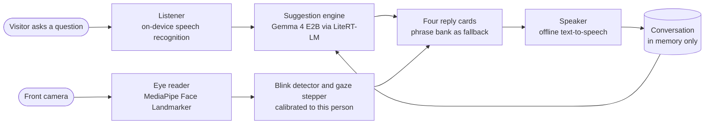

| Module | Job | Built with | Code |
|---|---|---|---|
| Eye reader | Camera frames in, eye-open values, gaze and iris points out | CameraX, MediaPipe Face Landmarker | `eye/` |
| Blink detector | Eye values in, deliberate blinks and long holds out | Our own state machine, pure Kotlin | `blink/` |
| Hand reader | Camera frames in, held hand signs out (optional) | MediaPipe Gesture Recognizer, our own hold rule in pure Kotlin | `hand/` |
| Gaze stepper and scanner | Moves the highlight by eye or on a timer | Pure Kotlin | `scan/` |
| Suggestion engine | Conversation in, four replies (or next words) out | Gemma 4 through LiteRT-LM, behind an interface | `suggest/` |
| Listener | Microphone in, question text out | Android on-device `SpeechRecognizer` | `listen/` |
| Speaker | Text in, speech out | Android `TextToSpeech`, offline voice | `speech/` |
| Conversation | Cards, choices, "Say anything", help alarm | Pure Kotlin | `conversation/`, `help/` |
| Calibration | Measures the eyes, sets the lines | Pure Kotlin | `setup/` |

All the decision logic (blinks, looks, cards, reply parsing, calibration) has no Android imports, so it is covered by JVM unit tests.

## Measured on the phone

From the app's own run logs on an iQOO 15 (vivo I2501, Android 16), 10 October 2026:

| | |
|---|---|
| Four replies from Gemma 4 E2B, GPU with multi-token prediction | **0.6 to 1.4 s**, typically 0.8 to 0.9 s |
| Model speed | 37 to 93 tokens per second, typically about 60 |
| Next words in "Say anything" | 0.6 to 1.0 s |
| Eye tracking | about 25 frames per second |
| Deliberate closes chosen in one 6-minute run | 39, from closes of 0.41 to 1.0 s; all 40 shorter blinks ignored |
| Phone temperature during a run | 32 to 36 °C, no heat warning |

The plan's target is replies on screen within 2 seconds. Day-by-day test results are in [PROGRESS.md](PROGRESS.md).

## Getting started

### What you need

- An Android phone with Android 12 or newer and a 64-bit Arm chip. Outspoken is tested on an iQOO 15.
- About 3 GB of free space for the model.
- An offline English voice for the phone's text-to-speech engine.
- A stand or holder that keeps the phone at arm's length, front camera facing the person.

### Install

1. Download `outspoken-debug-apk` from the latest green [CI run](https://github.com/DarkBird10020/outspoken/actions/workflows/ci.yml) and install it.
2. Open the app and allow the camera and microphone.
3. Get a model: tap the eye button (top right), then the sliders button, then **Model and logs**, and tap **Download** next to Gemma 4 E2B (2.6 GB, the default) or E4B (3.7 GB, slower but more accurate). The phone's browser downloads it from Hugging Face and the app loads it by itself; the app never goes online. A `.litertlm` file already on the phone can be picked with **Choose a model file**.
4. Stand the phone at arm's length and follow the spoken calibration.

The model files are not in this repository. Gemma is provided under the [Gemma terms of use](https://ai.google.dev/gemma/terms).

### Build from source

You need JDK 17 or newer and the Android SDK (API 36).

```bash
git clone https://github.com/DarkBird10020/outspoken.git
cd outspoken
./gradlew installDebug
```

Each laptop signs debug builds with its own key, so an APK built on one laptop cannot install over another's. To build with the team's shared key (the one CI uses), save it as `~/.android/outspoken-debug.keystore`; it is shared privately and never committed. The Model screen shows the build, so two phones can be compared.

## Using Outspoken

1. **Calibrate.** At every start the phone talks the person through it: look at the screen, look up, look down, close the eyes.
2. **Listen.** The visitor asks a question out loud. It shows on the "Heard" card and four replies appear.
3. **Choose.** Move the highlight to a reply and close both eyes for about half a second. The phone says it.
4. **Say anything.** Choose "Say anything" to build a sentence the cards do not offer, then Speak.
5. **Call for help.** Hold the eyes shut until the beep (2 seconds), open them, then blink or close them again. The alarm sounds.

| Button | Opens |
|---|---|
| Star | Practice round |
| Eye | Eye check, then **Settings** (sliders button), then **Model and logs** |
| Speech bubble | Live transcript |
| Bars | Session stats, all live: reply time counts up while the model writes |

## Privacy and safety

- **No internet.** The manifest removes the INTERNET permission, and CI fails any APK that has it. Model downloads go through the phone's own browser.
- **Nothing leaves the phone.** The conversation is kept in memory only. Run logs stay in `Android/data/com.outspoken/files/logs/` until the owner shares them with "Share logs".
- **Not a medical device.** Outspoken is a communication aid. It needs the person to control their blinking and to see the screen, and its replies are suggestions: the person always chooses what is said.

## Project structure

```text
app/src/main/java/com/outspoken/
├── MainActivity.kt   one activity, screen routing, Android services
├── blink/            blink and wink detection (pure Kotlin)
├── conversation/     board, phrase bank, Say anything, conversation controller
├── eye/              camera, MediaPipe face landmarks, eye values
├── help/             help alarm trigger and sound
├── listen/           on-device speech recognition, echo filter, quick topics
├── log/              run logs and log export
├── practice/         practice round
├── scan/             gaze stepper and timed scanner
├── setup/            calibration, tuning, model catalog and checks
├── speech/           offline text-to-speech
├── stats/            session numbers
├── suggest/          suggestion engine, prompts, reply parser, LiteRT-LM model
└── ui/               Jetpack Compose screens and the design theme
app/src/test/         JVM unit tests
docs/images/          README images
tools/                laptop helper to copy run logs from the phone
PRD.md                product brief
PROGRESS.md           what is built, how to test it, phone test history
```

## Development

```bash
./gradlew testDebugUnitTest   # unit tests
./gradlew lintDebug           # Android lint
./gradlew assembleDebug       # debug APK
```

Every push and pull request runs three checks in [CI](.github/workflows/ci.yml), all required before a merge to `main`:

| Check | What it catches |
|---|---|
| Unit tests | Broken logic, and any phone log committed by mistake |
| Android lint | Common Android mistakes |
| Build APK | Code that does not compile, and an APK that asks for INTERNET. Uploads `outspoken-debug-apk` |

Run logs are read with `adb logcat -s Outspoken`, shared from the Model screen, or copied with `tools/phone-logs.ps1`.

## Roadmap

| Milestone | Status |
|---|---|
| M0. Skeleton: camera and live eye values | Built |
| M1. Blink to speech with fixed phrases | Built, pass test ("I need water" ten times in a row) to run |
| M2. Model replies with phrase bank fallback | Built |
| M3. Listening, calibration, practice round | Built, pass test to run |
| M4. Help alarm, stats, laptop transcript | Built, pass test to run |
| M5. Freeze and ship | Next |
| Later | Hindi and Kannada speech, looking left or right as extra inputs |

## Contributing

Contributions are welcome. Read [CONTRIBUTING.md](CONTRIBUTING.md) before opening a pull request, and follow the [Code of Conduct](CODE_OF_CONDUCT.md). To report a security or privacy problem, see [SECURITY.md](SECURITY.md).

## Team

Built by [DarkBird10020](https://github.com/DarkBird10020) and [Atul-Chahar](https://github.com/Atul-Chahar), with screen design by our teammate.

## Acknowledgements

Outspoken is built on these open-source projects:

- [Kotlin](https://kotlinlang.org) and [kotlinx.coroutines](https://github.com/Kotlin/kotlinx.coroutines), Apache 2.0
- [Android Gradle Plugin](https://developer.android.com/build), Apache 2.0
- [AndroidX Core, Activity, Lifecycle](https://developer.android.com/jetpack/androidx), Apache 2.0
- [Jetpack Compose UI, UI tooling and Material 3](https://developer.android.com/jetpack/compose), Apache 2.0
- [CameraX](https://developer.android.com/media/camera/camerax), Apache 2.0
- [JUnit 4](https://junit.org/junit4/) (tests only), EPL 1.0
- [LiteRT-LM](https://github.com/google-ai-edge/LiteRT-LM), runs the Gemma model on the phone, Apache 2.0. Brings in [Gson](https://github.com/google/gson), Apache 2.0
- [MediaPipe Tasks Vision](https://github.com/google-ai-edge/mediapipe), Apache 2.0, with the [Face Landmarker model](https://developers.google.com/edge/mediapipe/solutions/vision/face_landmarker) (`app/src/main/assets/face_landmarker.task`), Apache 2.0, and the [Gesture Recognizer model](https://developers.google.com/edge/mediapipe/solutions/vision/gesture_recognizer) (`app/src/main/assets/gesture_recognizer.task`, from Google's [MediaPipe samples](https://github.com/google-ai-edge/mediapipe-samples/tree/main/examples/gesture_recognizer/android)), Apache 2.0
- [Gemma 4](https://ai.google.dev/gemma) models from [litert-community](https://huggingface.co/litert-community), downloaded on the phone, under the Gemma terms of use

Fonts:

- [Urbanist](https://github.com/coreyhu/Urbanist), SIL Open Font License 1.1. License text in [`licenses/Urbanist-OFL.txt`](licenses/Urbanist-OFL.txt).

## License

Outspoken is licensed under the [Apache License 2.0](LICENSE). Third-party libraries, models and fonts keep their own licenses, listed above.
